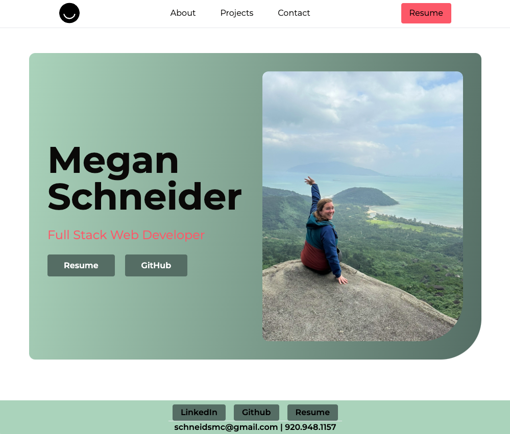

  
<h1 style= "text-align: center">React Portfolio </h1>

  
  
  

## Description 📚

This projects demonstrated the skills learned for utilizing React. I also focused a lot on working with React and Tailwind for the syling. There is a home page, about me page, projects page and a contact me page. This required practice in the `react-router-dom`. 

This portfolio is also responsive to different sized screens. 

## Table of Contents 

- [User-Story](#user-story)
- [Acceptance-Criteria](#acceptance-criteria)
- [Installation](#installation-📋)
- [Usage](#usage-🏁)
- [Demonstration](#demonstration)
- [Author](#author-👋🏽)

## User Story

AS AN employer looking for candidates with experience building single-page applications:
I WANT to view a potential employee's deployed React portfolio of work samples SO THAT I can assess whether they're a good candidate for an open position.

## Acceptance Criteria

GIVEN a single-page application portfolio for a web developer:
- WHEN I load the portfolio THEN I am presented with a page containing a header, a section for content, and a footer
- WHEN I view the header THEN I am presented with the developer's name and navigation with titles corresponding to different sections of the portfolio
- WHEN I view the navigation titles THEN I am presented with the titles About Me, Portfolio, Contact, and Resume, and the title corresponding to the current section is highlighted
- WHEN I click on a navigation title THEN I am presented with the corresponding section below the navigation without the page reloading and that title is highlighted
- WHEN I load the portfolio the first time THEN the About Me title and section are selected by default
- WHEN I am presented with the About Me section THEN I see a recent photo or avatar of the developer and a short bio about them
- WHEN I am presented with the Portfolio section THEN I see titled images of six of the developer’s applications with links to both the deployed applications and the corresponding GitHub repository
- WHEN I am presented with the Contact section THEN I see a contact form with fields for a name, an email address, and a message
- WHEN I move my cursor out of one of the form fields without entering text THEN I receive a notification that this field is required
- WHEN I enter text into the email address field THEN I receive a notification if I have entered an invalid email address
- WHEN I am presented with the Resume section THEN I see a link to a downloadable resume and a list of the developer’s proficiencies
- WHEN I view the footer THEN I am presented with text or icon links to the developer’s GitHub and LinkedIn profiles, and their profile on a third platform (Stack Overflow, Twitter) 

## Installation 📋

A user can clone this repository by running `git clone https://github.com/schneidsmc/profileReact.git` in the command line. Once the repository is on the local machine there are a couple commands to get this up and running in the code base. User needs to install al the dependancies by running `npm i`. After that run `npm run build` and `npm run dev` to get this launched on the localhost.

## Usage 🏁

This profile is deployed using netlify. 

[Here](https://meganschneider.netlify.app) is the link to the deployed page.

## Demonstration

 

## Author 👋🏽

GitHub Username: [schneidsmc](https://github.com/schneidsmc)

📧 Email: schneidsmc@gmail.com

This README was created with ❤️ using README Generator 👏🏽👏🏽

